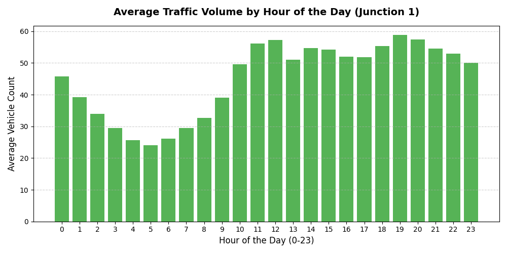
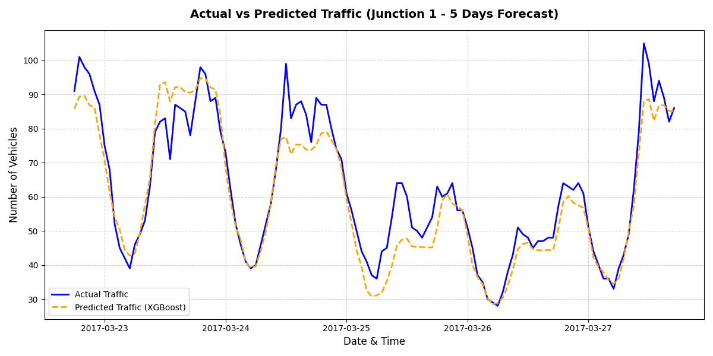

# 🏙️ Smart City Traffic Forecasting

A machine learning project to forecast traffic patterns at key city junctions using supervised learning (XGBoost). This model is designed to help local governments optimize infrastructure and prepare for traffic peaks.

## 📊 Project Highlights
*   **71.08% Improvement** in prediction accuracy over baseline average guessing.
*   **Validation RMSE**: 8.21 vehicles (meaning predictions are off by only 8 vehicles on average).
*   **Techniques**: Time-series feature engineering, chronological data splitting, Gradient Boosted Decision Trees.

## 🛠️ Features Engineered
XGBoost cannot read dates directly, so we extracted:
*   `Hour` (0-23): To capture daily rush-hour cycles.
*   `DayOfWeek` (0-6): To distinguish between weekdays and weekends.
*   `Month` (1-12): To handle monthly/seasonal variation.

## 📈 Visual Results

### 1. Hourly Traffic Average
Most junctions experience a major surge in traffic around the 19th hour (7:00 PM), with nighttime hours being quiet.


### 2. Actual vs. Predicted Traffic
Our XGBoost model tracks actual hourly traffic volume extremely closely over the forecast period:


## ⚙️ Setup and Installation
1. Install dependencies:
   ```bash
   pip install -r requirements.txt
   ```
2. Run EDA:
   ```bash
   python eda.py
   ```
3. Train model & generate plots:
   ```bash
   python train_predict.py
   ```
